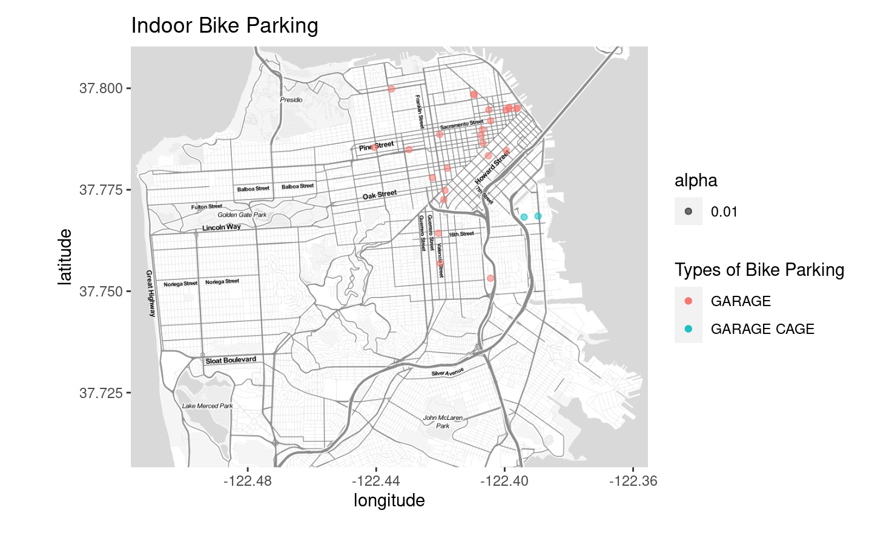
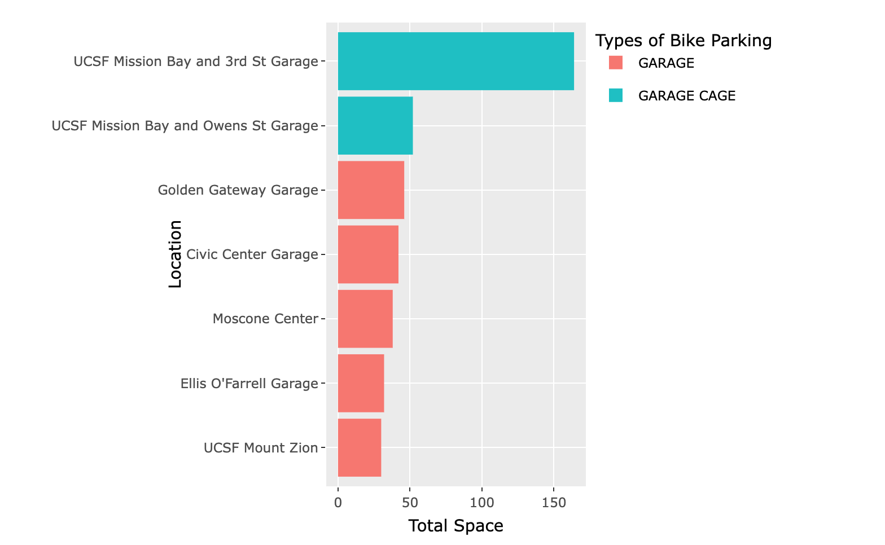
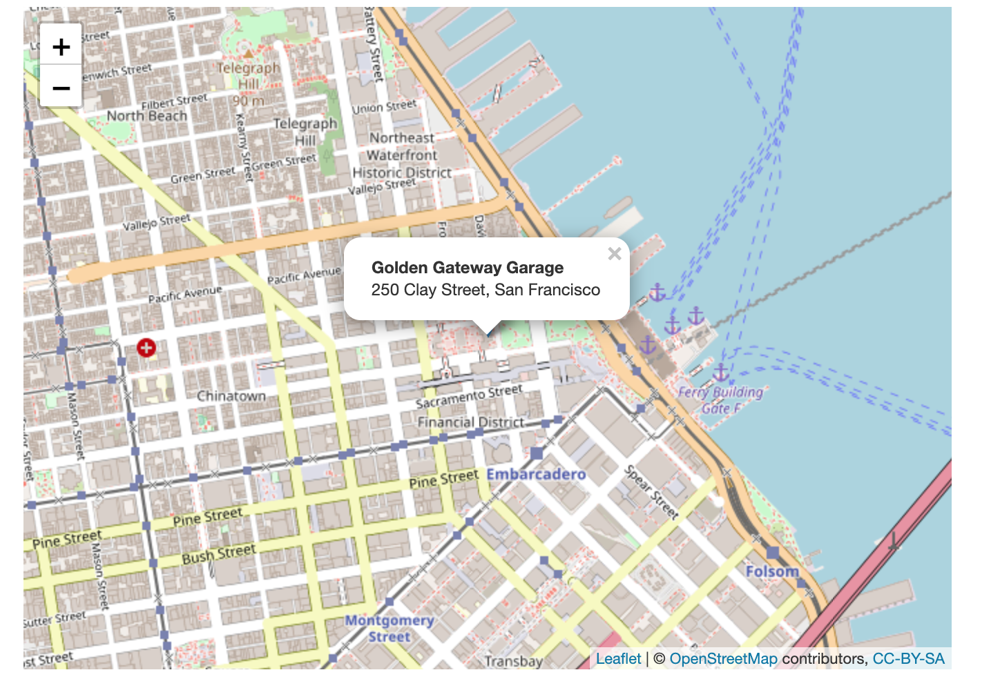

# San Francisco Bike Parking Facilities

San Francisco is known as a bike friendly city. In this report, I will use the  to explore the bike parking facilities. This topic interests me because I like to bike in San Franciso over the weekend. And whether or not I can find a bike rack easily could impact my travel plan. I hope the information in this report will be useful and interesting to you. 

Selective work of what's in the code:
1. Filter the data of interest, and visualiza on the map. 
2. Sort the data and visualize the stations by the number of spaces. 
3. Mark a location on the map. 

For details of wrangling please see the rmd file.
